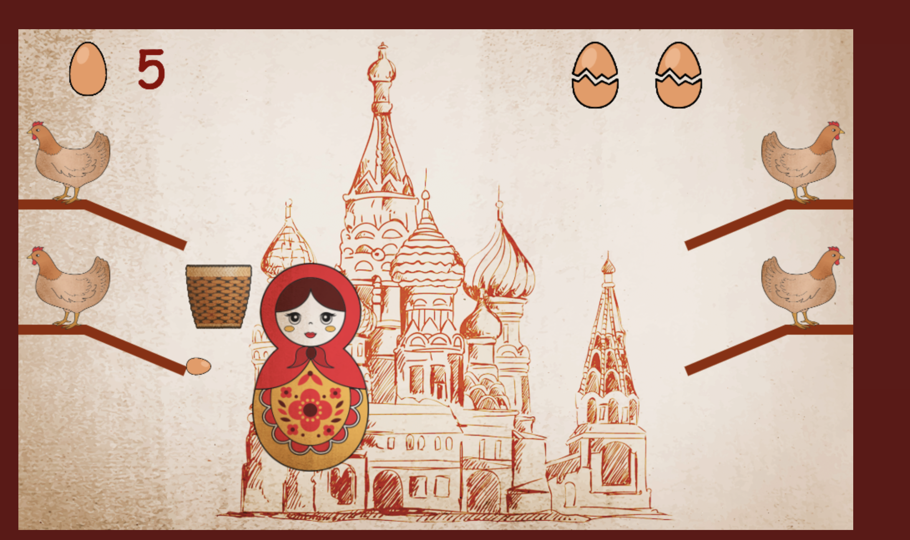
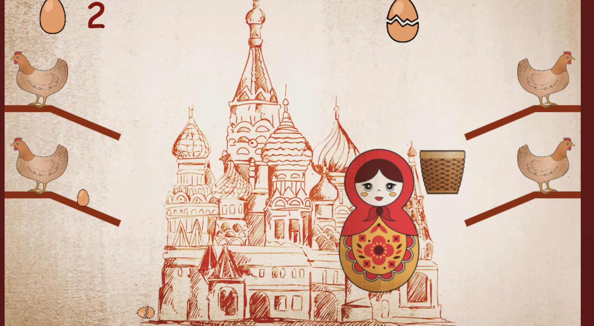
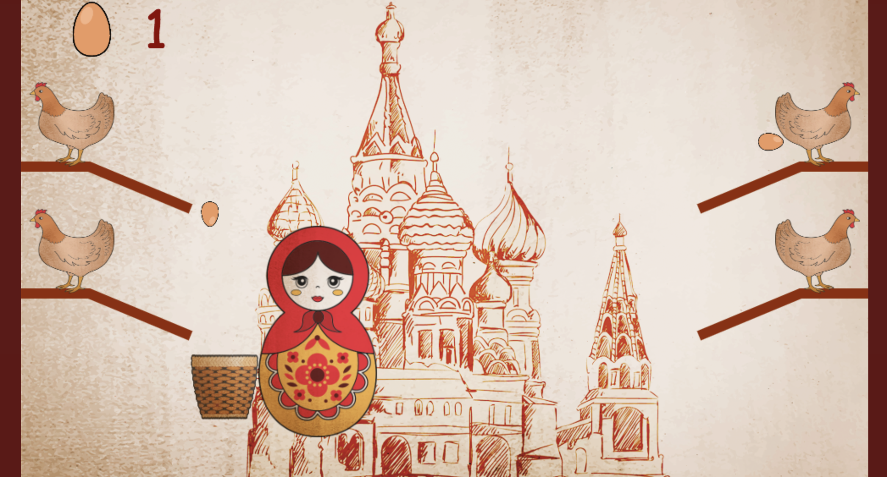
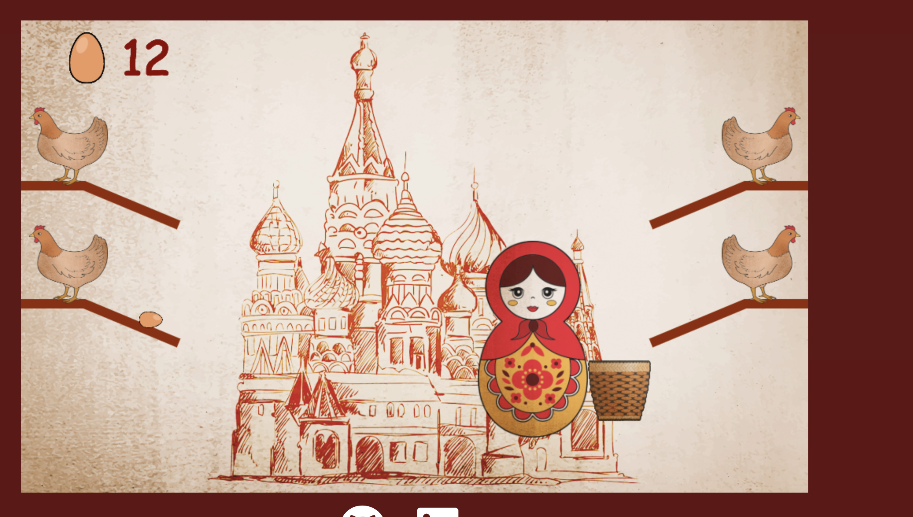
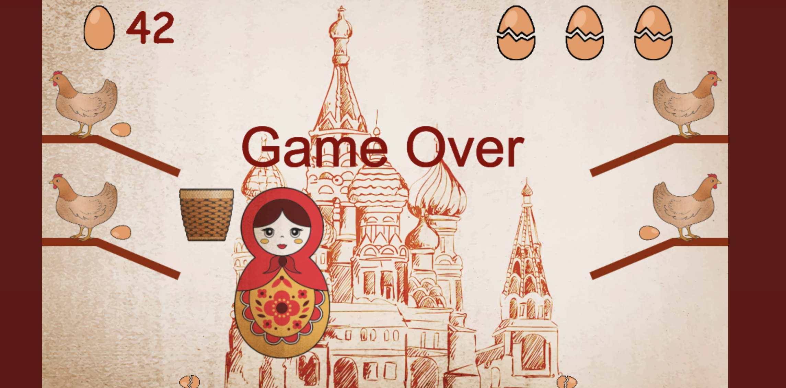
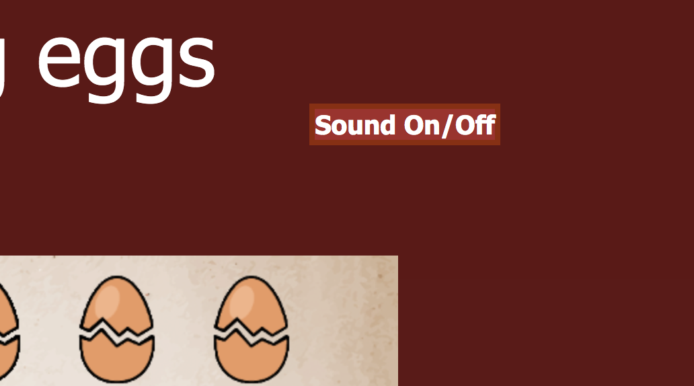

# Matroshka
### You can play the game [here](https://ashotovich1990.github.io/matroshka/)
***

#### I created this game in 3 days, inspired by an arcade game from my childhood. 

## RULES
 ### They are simple, if you drop three eggs you lose. 
 ### To move the doll and the basket
 * press 'A' on your keyboard 

 * press 'K' on your keyboard 
 
 * press 'Z' on your keyboard 
 
  * press 'M' on your keyboard 
 
 
 ### As you play on more and faster eggs will start coming on. 
 
 ### And don't forget to turn the sound on ;)
 

